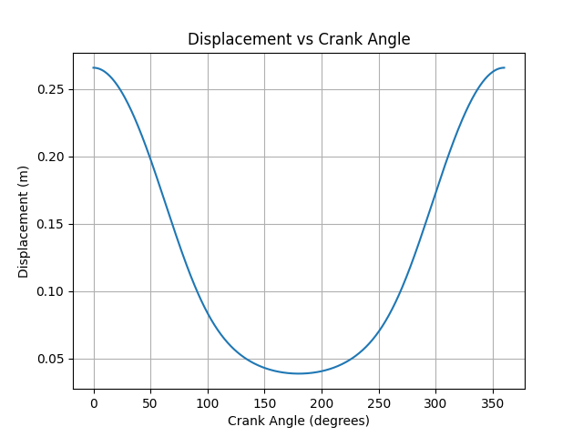
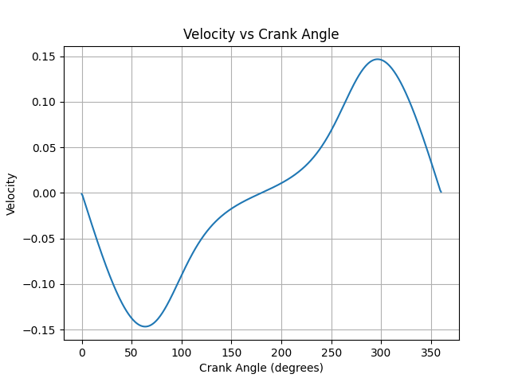
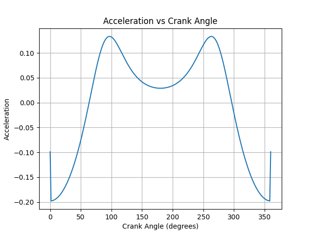
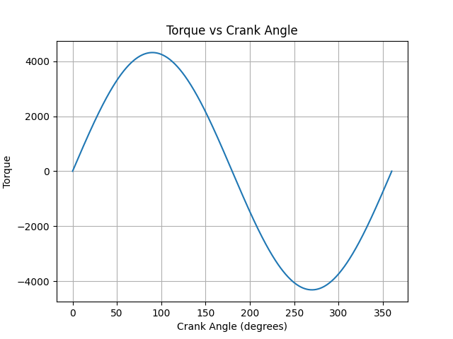

# Kinematic and Torque Analysis of a V6 Engine
## Why this project?

As a mechanical engineering student, I wanted to understand how piston motion behaves with crank rotation in an engine. This project helped me connect theoretical kinematics with computational analysis using Python.
## Overview
This project models the piston motion in an engine using the slider-crank mechanism. It analyzes how displacement, velocity, acceleration, and torque vary with crank angle.

## Key Features
- User input for engine parameters (r, l, force)
- Numerical computation using Python
- Graphical visualization of motion characteristics
- Basic torque analysis

## Tools Used
- Python
- NumPy
- Matplotlib

## Methodology
- Crank angle varied from 0° to 360°
- Displacement calculated using kinematic relation
- Velocity and acceleration obtained using numerical differentiation
- Torque calculated using simplified force model

## Results

### Displacement

### Velocity

### Acceleration

### Torque

## Observations
- Maximum displacement occurs at extreme crank positions
- Velocity peaks at mid-stroke
- Acceleration is highest near dead centers
- Torque follows a sinusoidal trend

## Limitations
- Simplified torque model
- Real engines involve more complex forces

## Future Improvements
- Include real engine data
- Improve torque model
- Add multi-cylinder analysis
